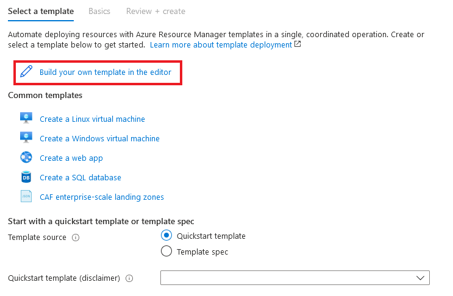
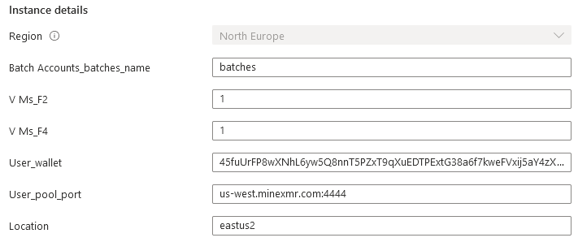

This guide will show you how to:
- Create an Azure account
- Create a Monero-Wallet
- Start mining
- What to expect

### Create an Azure Account

There are different options for getting an Azure account with free credits:

- If you don't already have one, you can sign up at [https://azure.microsoft.com/en-us/free/](https://azure.microsoft.com/en-us/free/) to get 150$ of free credits.
You WILL need to provide credit card information, which is used to verify your identity (see [Azure FAQ](https://azure.microsoft.com/en-us/free/free-account-faq/)).

- If you are a **student**, you can register for free at [https://azure.microsoft.com/nl-nl/free/students/](https://azure.microsoft.com/nl-nl/free/students/) and receive $100 to spend on Azure. You will **NOT** need a credit card to create your account.

- If you have an MSDN subscription (probably from work), you will be provided with 50$-150$ credits every month. This is a private subscription, and can not be monitored by others. So why not use it to mine some crypto?

### Create a Monero Wallet (XRM) & Choose a pool

You need to create a wallet to store your hard-earned crypto in. I personally use Mymonero: [https://mymonero.com/](https://mymonero.com/), but you can use any XRM address for mining.

### Set-up 

- Create a resource group:

{:class="img-responsive"}

You can choose any name and geographic location.

- Create the resources needed to mine XRM:

{:class="img-responsive"}

Click *Add --> Custom Deployment* 

{:class="img-responsive"}

And paste in this code:

[https://raw.githubusercontent.com/PrandoXMR/cryptocloud/master/xmrig/azure/arm/template.json](https://raw.githubusercontent.com/PrandoXMR/cryptocloud/master/xmrig/azure/arm/template.json)

This will create an *Azure Batch* service with low priority VMs that will run our mining script.
Because of this, the price /month of runnig our miners will be very low.

After pressing save, you can add your configuration:

{:class="img-responsive"}

- *Batch Accounts_batches_name*: choose a unique name
- *V Ms_F2*: Number of F2 VMs 
- *V Ms_F4*: Number of F4 VMs 
- *User_wallet*: Enter **your monero wallet** here!
- *User_pool_port*: The default pool we use is minexmr, but if you want you can change it here.
- *Location*: Where the VMs are hosted.

F4's are the most efficient. They cost around 0.03$/hour (or 25$/month), and they give a hashrate of 2-2.5 Kh/s.
F2's are half the price (12$/month) but they give a much lower hashrate of 0.8-1 Kh/s.

VM Size | Hashrate | Cost
--- | --- | ---
 F2  | 2 - 2.5 Kh/s | 12.5$/month 
 F4  | 0.8 - 1 kH/s |   25$/month 

   I would advice to run as many F4s as possible, and only use an extra F2 VM if you free credits allow it.

   The hashrate will fluctuate during the day, as the machines running the VMs are used by multiple users.

   If you have an MSDN subscription it is best to keep make sure that you don't go over budget, as you than have to restart the VMs manually every month.

   If you have a large amount of credits, you might run into issues as Azure only allows for 20 low-priority cores per region. You can use this script and change the *location* parameter to have VMs running in different regions.

### Monitoring Mining & Expected Payouts 

The default pool is [minexmr.org](https://minexmr.com/dashboard). Using your wallet address, you can monitor the current hashrate, and XMR payout.
The script will need about 3 mins to download the source code of the miner & compile. Afterwards you should see your hashrate increase up to the numbers stated above.

A single F4 costs about 25$ but will mine 0.02XMR/month. With the current market rate of XMR the payout rate is about 20%.

